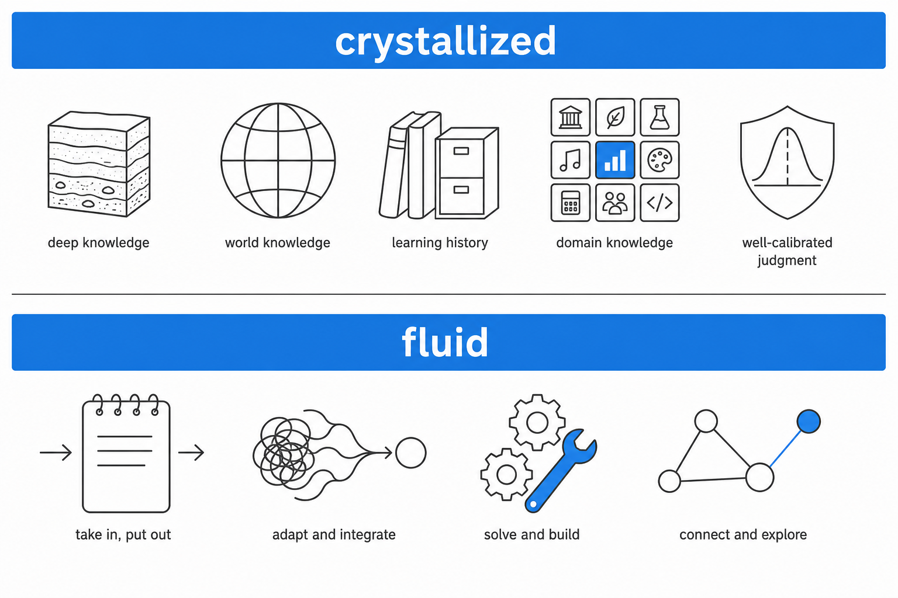
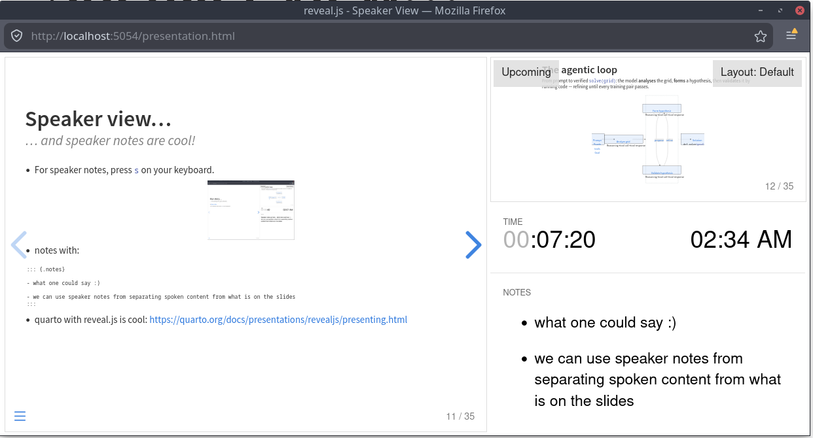

```{python}
#| echo: false
#| output: false
#| execute: true

# Setting up folder structure (will properly refactor later)
import sys
from pathlib import Path

def _find_blog_root():
    path = Path(".").resolve()
    for _ in range(10):
        if (path / "src" / "plotting.py").exists():
            return path
        if (path / "blog" / "src" / "plotting.py").exists():
            return path / "blog"
        path = path.parent
    return Path(".").resolve()

blog_root = _find_blog_root()
if str(blog_root) not in sys.path:
    sys.path.insert(0, str(blog_root))
```


# Intro

## About us
### From AGI Munich meetup to an amateur remote AI lab

::: {.columns}
::: {.column width="32%"}
:::: {style="text-align: center"}
**Dibya Chakravorty**
::::
{fig-align="center" width="70%"}

:::: {style="font-size: 0.85em"}

- Generalist Python developer & cloud architect; AGI enthusiast.

- Organises the [AGI Munich meetup](https://www.meetup.com/de-de/munchen-artificial-general-intelligence-meetup-group/).

::::

:::

::: {.column width="2%"}
:::


::: {.column width="32%"}

:::: {style="text-align: center"}
**Debsankha Manik**
::::
{fig-align="center" width="70%"}


:::: {style="font-size: 0.85em"}

- Dynamical systems, graph theory; data science &times; discrete optimisation.

- Loves teaching.

::::

:::

::: {.column width="2%"}

:::


::: {.column width="32%"}
:::: {style="text-align: center"}
**Bernhard Altaner**
::::
{fig-align="center" width="70%"}

:::: {style="font-size: 0.85em"}

- Thermodynamics and information processing in complex systems.

- Has local GlaDOS in his smart home.

::::

:::
:::

::: {.fragment style="text-align: center; font-size: 0.85em"}
*Supported by Nicolas Berg -- co-host of the AGI Munich meetup.*

*Thank you to Somayeh Vojdani & Tariq Baig-Meininghaus for initial discussions and continued encouragement.*
:::

::: {.notes}

- thank you to the organizers for giving us the opportunity to share our story
- first a couple of words about us
- Idea of paricipation in ARC-AGI-2 challenge originated with Dibya in the Munich AGI meetup
- Dibya and Debsankha know each other from Uni, Bernhard and Dibya have met only once previously at Debsankha's wedding
- Thank you to Nico for support
- Honorable mention of Somayeh and Tariq
:::


## What is this talk about?
### A journey into forefront AI research

::: {.incremental}
- **Our journey** into forefront AI research and lessons learned
- **ARC-AGI 2:** **A**bstraction and **R**easoning **C**orpus for **A**rtificial **G**eneral **I**ntelligence (**2**nd edition, 2025)
- **Task:** Transform pixel grids, where transformation rule is inferred from a few input–output pairs
:::
:::: {.fragment}
```{python}
#| echo: false
#| output: true
#| execute: true
#| fig-cap: "From the 'training pairs'..."

from src.plotting import show_puzzle, display_figure
fig = show_puzzle("9aaea919", show_code=False, show_test=False, width=1080,gap=0.33,pairs_per_row=3)
display_figure(fig, "puzzle")
```
::::

:::: {.fragment}
```{python}
#| echo: false
#| output: true
#| execute: true
#| fig-cap: "...infer the transformation rule!"

from src.plotting import show_puzzle, display_figure
fig = show_puzzle("9aaea919", show_code=False, show_test="only", width=1080,gap=0.33,pairs_per_row=3)
display_figure(fig, "puzzle")
```
::::

::: {.notes}
- This talk: our story of how we followed the bleeding edge of AI development for 9 months
- And what what we learned about fluid intelligence in LLMs
- But first things first: what is ARC AGI 2?
- ARC AGI 2 stands for **A**bstraction and **R**easoning **C**orpus for **A**rtificial **G**eneral **I**ntelligence
- Test-bed for **creative** solving of task beyond **learned pattern matching**, arguably one of the core aspects of *general* intelligence
- Best explained by an example
  - From training input-output pairs infer a general rule
  - And apply this to a "test" input
- Example puzzle shows
  - Abstraction (pixel grid -> concepts)
  - Reasoning (rule inference from examples)

:::


## ARC AGI 2
### Easy for humans, hard for AI?

::: {.incremental}
- ARC puzzles seem **intuitive** to us humans, but are not well-defined **mathematically**.
- Correct™ solution requires **core human preceptive priors**: objects, groups, proximity, numbers, etc.
- **Example:** A very intuitive and easy puzzle a 5-year old would solve...
:::
:::: {.fragment}
```{python}
#| echo: false
#| output: true
#| execute: true
#| fig-cap: "...should surely be easy for AI as well, right?"

from src.plotting import show_puzzle, display_figure
fig = show_puzzle("28a6681f", show_code=False, show_test=False, width=1080,gap=0.33,pairs_per_row=3)
display_figure(fig, "puzzle")
```
::::

:::: {.fragment}
```{python}
#| echo: false
#| output: true
#| execute: true
#| fig-cap: "Right?!"

from src.plotting import show_puzzle, display_figure
fig = show_puzzle("28a6681f", show_code=False, show_test="only", width=1080,gap=0.33,pairs_per_row=3)
display_figure(fig, "puzzle")
```
::::

::: {.incremental}
- **Question:** Is a prior **world model** needed to even understand the task? And if so, what **else** is needed?
:::

::: {.notes}
- Why are ARC puzzles usually intuitive for Humans, but potentially hard for AI?
- Task not well-defined mathematically: fit of a many-parameter function to 2-5 data points, hoping the function evaluates "correctly" at fixed other value
- Still, puzzles designed such that humans recognize "correct" solution
- So human priors are providing the extra context for a solution to be "unique"
- Concept on first example: grouping, counting, causality
- Does an AI need a physical world model to succeed?
- Does it need something else? If yes, what?
:::


## ARC-AGI as a general intelligence benchmark 
### From fluid flowing to fluid intelligence?

::: {.columns}
::: {.column width="55%"}

- Francois Chollet designed ARC AGI competition to test **skill acquisition efficiency**^[Francois Chollet, "ARC: A Reasoning Challenge Dataset for the Advancement of General Intelligence", arXiv:1911.01547, 2019.]:
  - Competion puzzles are kept private.
  - Memorization from training is not sufficient.
  - Only **few** "training pairs" per puzzle.


:::: {.fragment fragment-index=4}
- Tests for **fluid intelligence** (in contrast to *crystallized intelligence*).
::::

:::: {.fragment fragment-index=6}
- **Problem:** LLM weights only change during training and are **frozen during inference**.
::::

:::: {.fragment fragment-index=7}
- Need for **In-Context-Learning (ICL)**: Adaption to novel situations not encountered in training data.
::::

:::
::: {.column width="45%"}
:::: {.fragment fragment-index=5}

{fig-align="center" width="95%" .lightbox}
::::
:::
:::

:::: {.fragment fragment-index=8 style="text-align: center"}
**General intelligence** combines **knowledge** with **adaptation**!
::::


::: {.notes}
- Answer is explicit in the design of ARC AGI.
- Francois Chollet designed ARC AGI to test for **skill acquisition efficiency**
  - Competion puzzles are kept private -> not enter training data of models
  - Memorization from training is not sufficient -> puzzles are very diverse
  - Only **few** "training pairs" per puzzle.
- High level concept "water flowing under gravity" enables this efficiency (even though pixel-based rules might also succeed)
- This skill acquisition related **fluid** intelligence
- Contrasted by **crystallized** intelligence, Raymond Catell, 1948
  - *crystallized*: priors, world model, domain knowledge, mechanics of language -> **knowledge**
  - *fluid*: working memory, adaptation, complex skills, creativity -> **adaption**  
- **Problem:** LLM weights only change during training. Weights are frozen during inference.
- Some form of **in-context-learning** needed to understand and solve ARC puzzles
- General intelligence combines knowledge with adaptation!
:::


## State of the ARC in April 2025 
### On the shoulders of giants

::: {.fragment}
{fig-align="center" style="max-height: 58vh; width: auto; height: auto;" .lightbox}
:::

::: {.fragment style="text-align: center"}
  ⏺  **ARC-AGI 1:** Not saturated; multiple paradigms used; reasoning models give good results, but expensive
:::
::: {.fragment style="text-align: center"}
  ▲ **ARC-AGI 2:** barely any scores beyond noise (~3%) level
:::

::: {.notes}
- So, what was the state of this challenge in April 2025 when we started?
- In contrast to other benchmarks: 2D optimization, score and cost per puzzle
- Logarithmic-with-compute scaling won't land you in the top left corner ("efficiency" also in terms of compute baked it)
- details of the leaderboard not important, but some general observations:
- ARC AGI 1 (circles):
  - not solved
  - Test-time finetuning LLM approaches: Minds.ai (not public) and ARChitects, 53.5%,  
  - Program synthesis: Ryan Greenblatt
  - newer trends: reasoning models (o3, good but expensive)
- ARC AGI 2 (triangles):
  - essentially no results beyond noise level
:::


## Challenge accepted!
### Curiosity-driven YOLO meets Dunning-Krueger

::: {.columns}
::: {.column width="55%"}

::: {.fragment fragment-index=1}

- **Core context** at the beginning of 2025:
  - Reasoning models were an interesting way to scale compute during test time (Deepseek R1)
  - Program synthesis approach seemed promising
  - Tool use thought to be a big topic
:::

::: {.fragment fragment-index=2}
- **Straightforward plan:**
    + **Step one:** Generate synthetic data for this domain.
    + **Step two:** Fine-tune open weights models (with reasoning and tool use). 
    + **Step three:** Profit!
:::

::: {.fragment fragment-index=3}
- How hard could it be? 
:::

:::


::: {.column width="45%"}
::: {.fragment fragment-index=3}

{fig-align="center" width="95%" .lightbox}

:::
:::
:::

::: {.notes}
- Now that you understand what are is about, let me tell you briefly of our initial idea

- We realized a couple of core developments:
  - Reasoning models were an interesting way to scale compute during test time (and release of Deepseek R1 in january)
  - Program synthesis approaches seemed a promising approach
  - Tool use thought to be a big topic in 2025.

- **Our initial plan:** fine tune a reasoning model with tool use!
    + Step one: Generate synthetic data for this domain.
    + Step two: Finetune open weights models (with reasoning and tool use). 
  
- Surely, this is quite straightforward, Right?

- I will hand over to Dibya now to tell you what actually happened

:::

# Main part

## Our story...
### ...including the gory details

- [Dibyas slides...](https://hedgedoc.beralt.com/nUlPDyU_QRKvX0BWZXas0Q?view#Main-part)


# Conclusions

## Lessons learned
### A recap from the trenches

- **Tool use + reasoning look like fluid intelligence**
  - Python (or similar) grounds the model — filter bad hypotheses and replan.
  - Caveat from notes: some public write-ups underplayed strong models on ARC when evaluated *without* tool use.
- **Small / open-weight models punch above their reputation**
  - We roughly **4×**’d score on `gpt-oss-120b` with the right harness.
- **Synthetic data isn’t magic**
  - “Shortcut-y” traces skipped the messy reality of wrong hypotheses and recovery — undermines the training distribution you thought you had.


::: {.notes}
- Pretrained LLMs were ablw to detect patterns and reason about transformations.
- But each ARC puzzle were novel: required combining multiple learnt concepts in ways that were unique to each puzzle.
- Chain of thought allowed LLMs to perform that adaptation within each task.
- LLMs can do math within CoT, but it's error prone. Tool calling overcomes that hindrance.

:::


## At the bleeding edge
### Timeline: us vs the field

- **Format idea:** timeline with *our milestones* above and *community / papers* below.
  - Abstract-representation angle — e.g. Markovian thinker thread (August 2025).
  - Tool calling + iterative refinement trajectory.
  - Agentica / Confluence — fast convergence to a similar regime in the broader field.

```{python}
#| echo: false
#| output: false
#| execute: true
# Timeline sidecar: needs kaleido for PNG; point Quarto at a venv if needed, e.g.
#   QUARTO_PYTHON=.venv/bin/python quarto render posts/.../presentation.qmd

from src.plotting import create_horizontal_timeline, write_plotly_for_glightbox

_post = blog_root / "posts/agentic_coding_arc_agi"
_out = _post / "presentation-html"
write_plotly_for_glightbox(
    create_horizontal_timeline(),
    _out / "timeline-interactive.html",
    fig_key="timeline",
    preview_png_path=_out / "img" / "timeline-preview.png",
    caption="Team milestones vs broader AI context (example data)",
)
```

```{=html}
<div style="text-align:center;margin-top:0.75em">
  <a href="timeline-interactive.html"
     class="lightbox"
     data-type="external"
     data-width="90vw"
     data-height="85vh"
     data-description="Team milestones vs broader AI context (example data)"
     style="display:inline-block;cursor:pointer">
    
  </a>
</div>
```


## (Alternative) At the bleeding edge
### The frontier may be closer than it appears to be
- In Jan 2025, DeepSeek R1 was released, showed comparable performance to flagship models from OpenAI: The secret: reasoning and finetuning in verifiable domain.
  + In March, we decided to leverage reasoning models for ARC.
- In April, we wre using OpenAI models with tool calling for generating synthetic ARC-like puzzles.
  + No agentic coding harnesses were available. We orchestrated our own tool calling sandbox.
- In May, we started our foray into finetuning a Qwen model with tool calling.
  + Libraries (transformers and unsloth) "technically" supported it, but we had to fix the logic for masking tool call tokens correctly.
- In August 2025, GPT-OSS was released: capable of interleaved thinking and tool calling.
  + We started using it in our agentic harness immediately.
  + No commercial provider supported the maximum reasoning effort: We had to host our own inference engine (with custom patches).
  + In November 2025, we showed for the first time that open weight models can achieve nonzero scores on ARC-AGI-2.
- In November 2025, our coding harness was solving significant number of ARC puzzles in a single tool call loop, no human in the loop.
  + Claude code will be released in December.
- In Nov-Dec 2025, as Anthropic and OpenAI released their flagship models, they *underreported* their performance on ARC-AGI-2 (because they evals did not use tool calls).
  + We identified within weeks that tool calls boosts their performance on abstract reasoning.
  + Poetiq would claim SotA score in Dec 2025, using a similar, but more complicated approach.

## Practical take-home messages
### Working better with modern AI

::: {.incremental}
- **Don't over engineer agentic harnesses** (same failure mode as mega-prompts).
  - Complex harnesses generalize poorly to tasks with **different difficulty levels**.
  - LLMs armed with reasoning+tool use can *dynamically adapt* to the task: micromanaging each step hamstrings them.
- **Simplicity + verification**
  - Tell the model how to **deterministically evaluate** its output against the goal (partly why models struggle at open-ended art tasks).
  - But careful: LLMs will *hack the evaluator function* if they can.
- **There's plenty of room for innovation outside frontier labs**
  - Harnesses must continuously evolve as models gain more innate capabilities.
  - There will always be a ceiling to innate performance of flagship models: That's where things are exciting!
  - Open weight models often catch up to frontier models after a while.
:::

::: {.notes}
- LLMs are good at performing fuzzy search in a large space of actions: Let it do its job!
- Tell it *exactly* what you want it to do: otherwise it will hack the reward function.
- LLMs are fantastic at following instructions such as output format by now: use it.
:::

# Epilogue


## So… did ARC solvers crack the teaser puzzle? {.trace-slide-h}
### Paying off the intro example (`28a6681f`)
*Using GPT 5.5 XHigh*
```{=html}

<div class="trace-legend-h">
  <div class="legend-item">
    <svg viewBox="0 0 50 12">
      <defs>
        <marker id="lh-orange" viewBox="0 0 10 10" refX="9" refY="5" markerWidth="6" markerHeight="6" orient="auto">
          <path d="M0,0 L10,5 L0,10 z" fill="#cc6600"/>
        </marker>
      </defs>
      <line x1="2" y1="6" x2="40" y2="6" stroke="#cc6600" stroke-width="3" marker-end="url(#lh-orange)"/>
    </svg>
    <span>tool call</span>
  </div>
  <div class="legend-item">
    <svg viewBox="0 0 50 12">
      <defs>
        <marker id="lh-grey" viewBox="0 0 10 10" refX="9" refY="5" markerWidth="7" markerHeight="7" orient="auto">
          <path d="M0,0 L10,5 L0,10 z" fill="#666"/>
        </marker>
      </defs>
      <line x1="2" y1="6" x2="40" y2="6" stroke="#666" stroke-width="1.5" marker-end="url(#lh-grey)"/>
    </svg>
    <span>reasoning</span>
  </div>
</div>

<div class="trace-diagram-snake">
  <div class="snake-row">
    <div class="snake-pill-cell"><div class="snake-pill">Puzzle</div></div>
    <div class="snake-edge"><div class="snake-edge-arrow"><svg viewBox="0 0 50 14"><line x1="0" y1="7" x2="42" y2="7" stroke="#666" stroke-width="1.5"/><polygon points="41,3 41,11 48,7" fill="#666"/></svg></div><div class="snake-edge-label">understands</div></div>
    <div class="snake-main-cell">
      <div class="snake-main">Visual features</div>
      <div class="snake-vconnector"></div>
      <div class="snake-detail"><i>"water settling into crevices..." <br/> "...under gravity"</i></div>
    </div>
    <div class="snake-edge"><div class="snake-edge-arrow"><svg viewBox="0 0 50 14"><line x1="0" y1="7" x2="42" y2="7" stroke="#666" stroke-width="1.5"/><polygon points="41,3 41,11 48,7" fill="#666"/></svg></div><div class="snake-edge-label">develops</div></div>
    <div class="snake-main-cell">
      <div class="snake-main">Awareness of walls and flow dynamics</div>
      <div class="snake-vconnector"></div>
      <div class="snake-detail"><i>"flows around walls..." <br/> "...spills over a wall"</i></div>
    </div>
    <div class="snake-edge"><div class="snake-edge-arrow"><svg viewBox="0 0 50 14"><line x1="0" y1="7" x2="42" y2="7" stroke="#666" stroke-width="1.5"/><polygon points="41,3 41,11 48,7" fill="#666"/></svg></div><div class="snake-edge-label">transforms grid</div></div>
    <div class="snake-main-cell">
      <div class="snake-main">Text representation</div>
      <div class="snake-vconnector"></div>
      <div class="snake-detail"><code>........WW</br>........WW</br>.......GWW</br>.......GWW</br>.......GWW</br>.....G.GWW</br>.....G.GWW</br>....RG.GWW</br>....RG.GWW</br>.RRRRGGGWW</code></div>
    </div>
    <div class="snake-edge"><div class="snake-edge-arrow"><svg viewBox="0 0 50 14"><line x1="0" y1="7" x2="42" y2="7" stroke="#666" stroke-width="1.5"/><polygon points="41,3 41,11 48,7" fill="#666"/></svg></div><div class="snake-edge-label">hypothesizes</div></div>
    <div class="snake-main-cell">
      <div class="snake-main">Flow dynamics</div>
      <div class="snake-vconnector"></div>
      <div class="snake-detail"><i>"drops straight until it hits an obstacle" <br/> "...may slide down the diagonal"</i></div>
    </div>
  </div>

  <div class="snake-bend">
    <svg viewBox="0 0 1075 70" preserveAspectRatio="none">
      <defs>
        <marker id="snake-orange" viewBox="0 0 10 10" refX="9" refY="5" markerWidth="5" markerHeight="5" orient="auto">
          <path d="M0,0 L10,5 L0,10 z" fill="#cc6600"/>
        </marker>
      </defs>
      <path d="M 1003 0 L 1003 30 L 120 30 L 120 60" stroke="#cc6600" stroke-width="3" fill="none" stroke-linejoin="round" marker-end="url(#snake-orange)"/>
      <text x="560" y="20" text-anchor="middle" fill="#cc6600" font-weight="700" font-size="20" font-family="inherit">Tool call</text>
    </svg>
  </div>

  <div class="snake-row">
    <div class="snake-main-cell">
      <div class="snake-main">Trial solution using simulation</div>
      <div class="snake-vconnector"></div>
      <div class="snake-detail"><i>checks gravity direction, horizontal flow rule bad &rarr; oscillations</i></div>
    </div>
    <div class="snake-edge"><div class="snake-edge-arrow"><svg viewBox="0 0 50 14"><line x1="0" y1="7" x2="42" y2="7" stroke="#666" stroke-width="1.5"/><polygon points="41,3 41,11 48,7" fill="#666"/></svg></div><div class="snake-edge-label">adds tracing</div></div>
    <div class="snake-main-cell">
      <div class="snake-main">Oscillation bug found</div>
      <div class="snake-vconnector"></div>
      <div class="snake-detail"><i>&lsquo;Fixes&rsquo; by left-over-right tie breaking</i></div>
    </div>
    <div class="snake-edge"><div class="snake-edge-arrow"><svg viewBox="0 0 50 14"><line x1="0" y1="7" x2="42" y2="7" stroke="#666" stroke-width="1.5"/><polygon points="41,3 41,11 48,7" fill="#666"/></svg></div><div class="snake-edge-label">applies solution on</div></div>
    <div class="snake-main-cell">
      <div class="snake-main">Test example</div>
      <div class="snake-vconnector"></div>
      <div class="snake-detail"><i>left-over-right tie breaking needed to avoid infinite loop</i></div>
    </div>
    <div class="snake-edge"><div class="snake-edge-arrow"><svg viewBox="0 0 50 14"><line x1="0" y1="7" x2="42" y2="7" stroke="#666" stroke-width="1.5"/><polygon points="41,3 41,11 48,7" fill="#666"/></svg></div><div class="snake-edge-label">submits</div></div>
    <div class="snake-pill-cell"><div class="snake-pill">Solution</div></div>
  </div>
</div>
```

::: {.notes}
- Same story as the previous slide, in one picture.
- Blue = main step; gray = the model's own words; green = input/output. The orange "Tool call" edge marks where the agent reaches for code.
- Linear left column: intuition (Visual features) &rarr; abstraction (Text representation) &rarr; simulation (Trial solution) &rarr; the hardcoded patch ("'Fixes' by left-over-right") &rarr; Solution.
- This puzzle is a simple physics simulation: awesome that our harness solves it.
- Doesn't discover "laws of physics" obviously. But it comes close.
- Its musings are quite illuminating: "I'm also wondering about whether to prioritize left over right in physical rules"
:::


## Look: an almost physics simulator
### The LLM implemented that without any prompting

```{python}
#| echo: false
#| output: asis
#| execute: true

import base64
import importlib.util
import io
import os
from pathlib import Path

import numpy as np
from PIL import Image


N_STEPS = 25
from src.show_step import simulate
from src.data import load_puzzle
from src.plotting import _get_arc_colors


def _hex_to_rgb(h):
    h = h.lstrip("#")
    if len(h) == 3:
        h = "".join(c * 2 for c in h)
    return (int(h[0:2], 16), int(h[2:4], 16), int(h[4:6], 16))


_grid = load_puzzle("28a6681f")["test"][0]["input"]
_H, _W = len(_grid), len(_grid[0])
_palette = np.array([_hex_to_rgb(c) for c in _get_arc_colors()], dtype=np.uint8)
_cell, _gap = 56, 2
_img_h = _H * _cell + (_H + 1) * _gap
_img_w = _W * _cell + (_W + 1) * _gap

_frames = []
for _n in range(1, N_STEPS):
    _arr, _ = simulate(_grid, dirs=("L", "R"), max_steps=_n)
    _arr = np.asarray(_arr, dtype=np.int64)
    _canvas = np.full((_img_h, _img_w, 3), 255, dtype=np.uint8)
    for _r in range(_H):
        _y0 = _gap + _r * (_cell + _gap)
        for _c in range(_W):
            _x0 = _gap + _c * (_cell + _gap)
            _canvas[_y0:_y0 + _cell, _x0:_x0 + _cell] = _palette[_arr[_r, _c]]
    _frames.append(Image.fromarray(_canvas, mode="RGB").quantize(colors=16))

_buf = io.BytesIO()
_frames[0].save(
    _buf,
    format="GIF",
    save_all=True,
    append_images=_frames[1:],
    duration=350,
    loop=0,
    disposal=2,
    optimize=False,
)
_b64 = base64.b64encode(_buf.getvalue()).decode()
print(
    f'<div style="display:flex;justify-content:center;align-items:center;height:65vh;">'
    f''
    f'</div>'
)
```


## The simulator is imperfect
### because it doesn't generalize to certain wall placements

```{python}
#| echo: false
#| output: asis
#| execute: true

import base64
import io
import sys
from pathlib import Path

import numpy as np
from PIL import Image

N_STEPS = 25
from src.show_step import simulate
from src.data import load_puzzle
from src.plotting import _get_arc_colors


def _hex_to_rgb(h):
    h = h.lstrip("#")
    if len(h) == 3:
        h = "".join(c * 2 for c in h)
    return (int(h[0:2], 16), int(h[2:4], 16), int(h[4:6], 16))


_grid = load_puzzle("28a6681f")["test"][0]["input"]
_grid = [row[-1::-1] for row in _grid]

_H, _W = len(_grid), len(_grid[0])
_palette = np.array([_hex_to_rgb(c) for c in _get_arc_colors()], dtype=np.uint8)
_cell, _gap = 56, 2
_img_h = _H * _cell + (_H + 1) * _gap
_img_w = _W * _cell + (_W + 1) * _gap

_frames = []
for _n in range(1, N_STEPS):
    _arr, _ = simulate(_grid, dirs=("L", "R"), max_steps=_n)
    _arr = np.asarray(_arr, dtype=np.int64)
    _canvas = np.full((_img_h, _img_w, 3), 255, dtype=np.uint8)
    for _r in range(_H):
        _y0 = _gap + _r * (_cell + _gap)
        for _c in range(_W):
            _x0 = _gap + _c * (_cell + _gap)
            _canvas[_y0:_y0 + _cell, _x0:_x0 + _cell] = _palette[_arr[_r, _c]]
    _frames.append(Image.fromarray(_canvas, mode="RGB").quantize(colors=16))

_buf = io.BytesIO()
_frames[0].save(
    _buf,
    format="GIF",
    save_all=True,
    append_images=_frames[1:],
    duration=350,
    loop=0,
    disposal=2,
    optimize=False,
)
_b64 = base64.b64encode(_buf.getvalue()).decode()
print(
    f'<div style="display:flex;justify-content:center;align-items:center;height:65vh;">'
    f''
    f'</div>'
)
```


## Do LLMs have fluid intelligence?
### Yes.

- arc-agi 3

# Appendix (backup)

## To RL or not to RL?
### That was the question...

- Built intuition for RL *with tool calling* (e.g. the `verl` stack — very new territory).
  - Rollouts — many candidate solutions per puzzle — are expensive.
  - Keeping learner vs inference tokenizer / template details aligned was fiddly.


# Old main part slides

## Finetuning requires data
### Synthetic data or bust

- By design, no large ARC-AGI-comparable puzzle datasets: the benchmark targets *inference-time* pattern recognition.
- We needed thousands of *genuinely distinct* puzzles — mechanical augmentation of existing puzzles was not enough.
- We needed *interleaved thinking* traces: `puzzle → thinking → tool call → thinking → output grid`, i.e. program synthesis with a Python REPL.
- *Optional:* add a pipeline diagram when ready.


## Synthetic data and solution traces
### New puzzles, teaching traces for free

::: {.notes}
Sidebar: show an example of a synthetic puzzle on the next slides.
:::

- Idea: *create* synthetic puzzles programmatically, with “fake” solution traces, using an LLM plus Python.
- **Lessons**
  - Powerful models were required — for puzzles that are not useless, and for explanations that are actually useful.
  - **Cost:** expensive in practice (opportunistic “free tier” tokens).
  - *Line plot idea:* time vs number of puzzles (OpenAI, DeepSeek).

::: {.notes}
Hopefully no one from OpenAI in the audience.
:::


## Example synthetic puzzle and solution trace
### Part 1 — build & prompts

- Build the puzzle programmatically (trace / prompt example).
- Set up the generation loop so traces match the tool-call format you want for SFT.


## Example synthetic puzzle and solution trace
### Part 2 — puzzle & trace

- Show a representative synthetic puzzle.
- Show a schematic of the solution trace (thinking + tools + final grid).


## Move fast and break things
### SFT + reasoning + tool calling = bleeding edge (and YOLO libraries)

- Fine-tuned “small” Qwen3 models (7B and 14B): still VRAM-hungry for efficient SFT → **Unsloth**.
- Stock Qwen chat templates on Hugging Face did not handle tool-call tokens correctly → we wrote our own template for SFT.

{fig-align="center" width="70%" .lightbox}


## VRAM economy is crucial
### Our personal RAM crisis

- Unsloth focuses on cutting VRAM — essential even for 7–14B on consumer GPUs.
- A few nasty surprises along the way.
- We tracked experiments diligently with MLOps tooling.
- *Optional:* Weights & Biases screenshot.


## Goal: end-to-end fine tuning of an agentic pipeline
### Making a small-memory student think good(TM)

- Solving ARC-AGI 2 involves:
  - Understanding input and output grids (vision).
  - Inferring the input → output rule.
  - Applying that rule to the test grid.
- *Optional:* scanned flowchart of the harness — complexity is the point (audience need not decode every box).


## RL training: what is it about
### You need something to reinforce

- RL makes the “correct” trajectory more likely after enough iterations — the model needs a *germ* of competence first.

{fig-align="center" width="72%" .lightbox}

- **Our issue:** SFT’d Qwen models showed little sign of life — no recovery after a wrong approach.


## Synthetic solutions were never wrong
### Don’t think of the yellow elephant

- Training traces did not mirror real solving: rarely does everything go right on the first hypothesis.
- The model that *generated* the puzzle (and knew the answer) was *pretending* to discover the solution — so traces looked unrealistically clean.
- It never needed to backtrack or recover from a bad idea.
- **What we’d need:** a model that occasionally solves ARC-AGI 2 with visible reasoning traces to mine for SFT (frontier models often didn’t expose that) — *we never shipped that route in the end.*

::: {.notes}
Side note from notes: frontier models lacked traces; we ultimately did not pursue this fine-tuning path.
:::


## First pivot: solver pipeline + interleaved thinking
### Pivoting toward test-time scaling (thinking-first)

- **Stack:** vLLM + Harmony template — engineering overhead.
- Interleaved-thinking schematic drove the UX of the solver.
- **Surprise:** GPT-OSS-120B was unexpectedly strong in our agentic harness.
- **Hypothesis:** agentic RL pretraining wakes “dormant” capabilities worth leveraging even below frontier scale.


## The second pivot: keep it simple, stupid
### The main epiphany

- Tool calling + interleaved thinking ≫ our overwrought harness complexity.
- *Example slide idea:* contrast a simplified trace with the older pipeline.safsdf


## State of the art scores
### First non-trivial results for open-weight models

- Score “jumps” as we iterated on harness and models.

```{python}
#| echo: false
#| output: false
#| execute: true
from src.plotting import create_baseline_interleaved_scatter, write_plotly_for_glightbox

_post = blog_root / "posts/agentic_coding_arc_agi"
_out = _post / "presentation-html"
write_plotly_for_glightbox(
    create_baseline_interleaved_scatter(),
    _out / "scores-scatter-interactive.html",
    fig_key="scatter_baseline_vs_interleaved",
    preview_png_path=_out / "img" / "scores-scatter-preview.png",
)
```

```{=html}
<div style="text-align:center;margin-top:0.75em">
  <a href="scores-scatter-interactive.html"
     class="lightbox"
     data-type="external"
     data-width="90vw"
     data-height="85vh"
     style="display:inline-block;cursor:pointer">
    
  </a>
</div>
```


# Random

## Speaker view...
### ... and speaker notes are cool!

- For speaker notes, press `s` on your keyboard.
{fig-align="center" width="50%"}
- notes with:

```
::: {.notes}

- what one could say :) 

- note that lightbox overlays need to be triggered from presentation screen html window

- we can use speaker notes from separating spoken content from what is on the slides
:::
```
- quarto with reveal.js is cool: [https://quarto.org/docs/presentations/revealjs/presenting.html](https://quarto.org/docs/presentations/revealjs/presenting.html)


::: {.notes}

- what one could say :) 

- we can use speaker notes from separating spoken content from what is on the slides
:::


## Lightbox test
### Figure direct

```{python}
#| echo: false
#| output: true
#| execute: true
from src.plotting import create_dummy_scatter

fig=create_dummy_scatter()
fig.show()
```

## Lightbox test — Strategy A (GLightbox iframe)
### Click the preview to open the interactive figure in a modal

```{python}
#| echo: false
#| output: false
#| execute: true
#| fig-cap: "hasdfasfas"

from src.plotting import create_dummy_scatter, write_plotly_for_glightbox

_post = blog_root / "posts/agentic_coding_arc_agi"
_out = _post / "presentation-html"
write_plotly_for_glightbox(
    create_dummy_scatter(),
    _out / "dummy-glightbox-interactive.html",
    fig_key="dummy",
    preview_png_path=_out / "img" / "dummy-glightbox-preview.png",
    caption="Demo scatter — hover to inspect points, scroll to zoom, drag to pan.",
)
```

```{=html}
<div style="text-align:center;margin-top:0.75em">
  <a href="dummy-glightbox-interactive.html"
     class="lightbox"
     data-type="external"
     data-width="90vw"
     data-height="85vh"
     data-description="Demo scatter — hover to inspect points, scroll to zoom, drag to pan."
     style="display:inline-block;cursor:pointer">
    
  </a>
</div>
```


