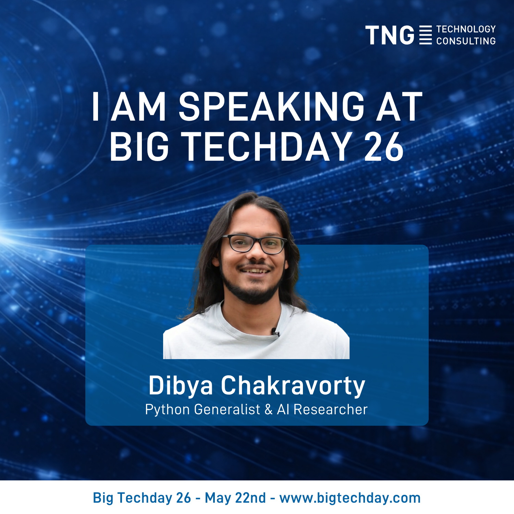
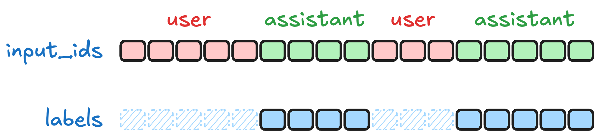
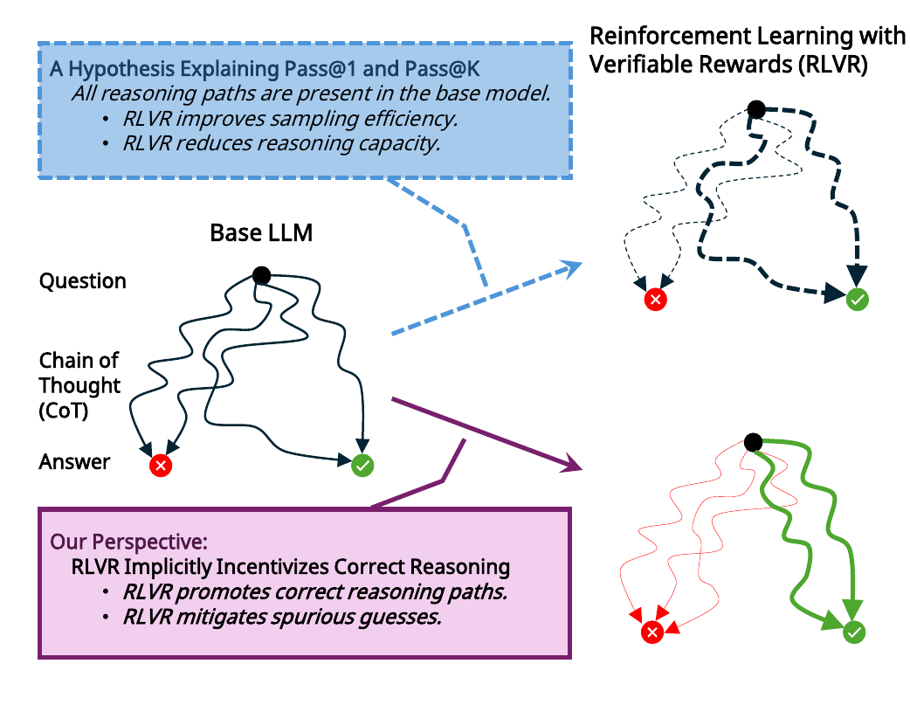

```{python}
#| echo: false
#| output: false
#| execute: true

# Setting up folder structure (will properly refactor later)
import sys
from pathlib import Path

def _find_blog_root():
    path = Path(".").resolve()
    for _ in range(10):
        if (path / "src" / "plotting.py").exists():
            return path
        if (path / "blog" / "src" / "plotting.py").exists():
            return path / "blog"
        path = path.parent
    return Path(".").resolve()

blog_root = _find_blog_root()
if str(blog_root) not in sys.path:
    sys.path.insert(0, str(blog_root))
```


# Intro

## About us
### From an AGI meetup in Munich to a small AI lab

::: {.columns}
::: {.column width="33%"}
**Dibya Chakravorty**
{fig-align="center" width="80%"}


- Physics major; AGI-curious since *The Emperor's New Mind*.

- Generalist Python developer & cloud architect.

- Organises the [AGI Munich meetup](https://www.meetup.com/de-de/munchen-artificial-general-intelligence-meetup-group/).

:::
::: {.column width="33%"}
**Debsankha Manik**
{fig-align="center" width="80%"}

- Theoretical physicist by training.

- Dynamical systems, graph theory; data science &times; discrete optimisation.

- Loves teaching.


:::
::: {.column width="33%"}

**Bernhard Altaner**
{fig-align="center" width="80%"}

- Physics and maths, academic positions on information processing in complex systems.

- Interested AI and consciousness.

- Likes to have GlaDOS managing his smart home.

:::
:::

*With Nicolas Berg &mdash; co-host of the AGI Munich meetup.*


## ARC AGI 2
### What is this talking about?

::: {.incremental}
- **ARC-AGI:** Abstraction and Reasoning Corpus for Artificial General Intelligence
- **Task:** Transform pixel grids, where transformation rule is inferred from a few input–output pairs
- **Example:**
:::
:::: {.fragment}
```{python}
#| echo: false
#| output: true
#| execute: true
#| fig-cap: "From the 'training pairs'..."

from src.plotting import show_puzzle, display_figure
fig = show_puzzle("9aaea919", show_code=False, show_test=False, width=1080,gap=0.33,pairs_per_row=3)
display_figure(fig, "puzzle")
```
::::

:::: {.fragment}
```{python}
#| echo: false
#| output: true
#| execute: true
#| fig-cap: "...infer the transformation rule!"

from src.plotting import show_puzzle, display_figure
fig = show_puzzle("9aaea919", show_code=False, show_test="only", width=1080,gap=0.33,pairs_per_row=3)
display_figure(fig, "puzzle")
```
::::


## ARC AGI 2
### Easy for humans, hard for AI?

::: {.incremental}
- ARC puzzles seem **intuitive** to us humans, but...
- ... are not well-defined **mathematically**.
- **Core human preceptive priors**: objects, groups, proximity, numbers, spatial relationships, etc.
- **World model** needed to reason about the task?
- **Example:** A very intuitive and easy puzzle a 5-year old would solve...
:::
:::: {.fragment}
```{python}
#| echo: false
#| output: true
#| execute: true
#| fig-cap: "...should surely be easy for AI as well, right?"

from src.plotting import show_puzzle, display_figure
fig = show_puzzle("28a6681f", show_code=False, show_test=False, width=1080,gap=0.33,pairs_per_row=3)
display_figure(fig, "puzzle")
```
::::

:::: {.fragment}
```{python}
#| echo: false
#| output: true
#| execute: true
#| fig-cap: "Right?!"

from src.plotting import show_puzzle, display_figure
fig = show_puzzle("28a6681f", show_code=False, show_test="only", width=1080,gap=0.33,pairs_per_row=3)
display_figure(fig, "puzzle")
```
::::


## Fluid intelligence
### Why are these puzzles interesting as an intelligence benchmark?

- LLM weights only change during training. Weights are frozen during inference.
- How well can LLMs adapt to novel situations not present in training data? This is called In-Context-Learning (ICL).
- ARC AGI tests for that:
    - models are tested on completely novel puzzles that are kept private (not on the internet).
    - Pure memorization from training data ("stochastic parrot") will not help.
    - For each puzzle, the model needs to deduce a novel transformation rule from just a **few** shown examples. The model needs to **efficient** in rule induction.
- The benchmark tests what Chollet calls **skill acquisition efficiency** or **fluid intelligence**.
- Fluid intelligence is not just about **knowledge**, and also very much about **adaptation**.


## ARC-AGI as a benchmark 
### Blast from the past before "vibe coding" became mainstream

- **Two-dimensional challenge:** score *and* cost per puzzle
- **State of the art April 2025:** *ARC-AGI 1 was not saturated then, ARC-AGI 2 just out*
    - **ARC-AGI 1:** OpenAI ChatGPT-o1-pro, 50% pass@2, ~ 50$/puzzle
    - **ARC-AGI 2:** barely any nontrivial scores
    - **No established meta**: LLM-based and domain-specific language approaches used

{fig-align="center" width="60%" .lightbox}


## Challenge accepted!
### Leeroy Jenkins, Dunning-Krueger and YOLO

  - **Premises** when we started:
    + first open weight reasoning model was DeepSeek R1 (Jan 2025)
    + tool use was thought to be a big topic in 2025.
  - **Our initial plan:** fine tune a reasoning model with tool use!
    + Generate synthetic data for this domain.
    + Finetune open weights models (with reasoning and tool use). 
  - And so the story begins...


# Main part

## Our story...
### ...including the gory details

- [Dibyas slides...](https://hedgedoc.beralt.com/nUlPDyU_QRKvX0BWZXas0Q?view#Main-part)


## The agentic loop

From prompt to verified `solve(grid)`: the model **analyses** the grid, **forms** a hypothesis, then **validates** it by running code &mdash; refining until every training pair passes.

```{mermaid}
%%| fig-align: center
%%{init: {"flowchart": {"curve": "basis", "htmlLabels": true, "nodeSpacing": 70, "rankSpacing": 80, "padding": 0}} }%%
flowchart LR
    Prompt["<div class='cardLabel'><div class='boxHeader'>Prompt</div><div class='boxBody'><div>Puzzle</div><div>tools</div><div>Goal</div></div></div>"]
    Step1["<div class='cardLabel'><div class='boxHeader'>Analyze grid</div><div class='boxBody horizontal'><span class='subBox'>Reasoning</span><span class='arrow'>→</span><span class='subBox'>tool call</span><span class='arrow'>→</span><span class='subBox'>tool response</span></div></div>"]
    Solution["<div class='cardLabel'><div class='boxHeader'>Solution</div><div class='boxBody'><code><span class='py-kw'>def</span>&nbsp;<span class='py-fn'>solve</span>(grid):</code><code>&nbsp;&nbsp;&nbsp;&nbsp;...</code></div></div>"]

    subgraph Loop[" "]
        direction TB
        Step2["<div class='cardLabel'><div class='boxHeader'>Form hypothesis</div><div class='boxBody horizontal'><span class='subBox'>Reasoning</span><span class='arrow'>→</span><span class='subBox'>tool call</span><span class='arrow'>→</span><span class='subBox'>tool response</span></div></div>"]
        Step3["<div class='cardLabel'><div class='boxHeader'>Validate hypothesis</div><div class='boxBody horizontal'><span class='subBox'>Reasoning</span><span class='arrow'>→</span><span class='subBox'>tool call</span><span class='arrow'>→</span><span class='subBox'>tool response</span></div></div>"]
        Step2 -->|propose| Step3
        Step3 ---->|refine| Step2
    end

    Prompt --> Step1
    Step1 --> Loop
    Loop -.-> Solution

    classDef loopRegion fill:none,stroke:#9aa,stroke-dasharray:5 4;
    class Loop loopRegion;
```


## Lessons learned
### A recap from the trenches

- **Tool use + reasoning look like fluid intelligence**
  - Python (or similar) grounds the model — filter bad hypotheses and replan.
  - Caveat from notes: some public write-ups underplayed strong models on ARC when evaluated *without* tool use.
- **Small / open-weight models punch above their reputation**
  - We roughly **4×**’d score on `gpt-oss-120b` with the right harness.
- **Synthetic data isn’t magic**
  - “Shortcut-y” traces skipped the messy reality of wrong hypotheses and recovery — undermines the training distribution you thought you had.


## At the bleeding edge
### Timeline: us vs the field

- **Format idea:** timeline with *our milestones* above and *community / papers* below.
  - Abstract-representation angle — e.g. Markovian thinker thread (August 2025).
  - Tool calling + iterative refinement trajectory.
  - Agentica / Confluence — fast convergence to a similar regime in the broader field.

```{python}
#| echo: false
#| output: false
#| execute: true
# Timeline sidecar: needs kaleido for PNG; point Quarto at a venv if needed, e.g.
#   QUARTO_PYTHON=.venv/bin/python quarto render posts/.../presentation.qmd

from src.plotting import create_horizontal_timeline, write_plotly_for_glightbox

_post = blog_root / "posts/agentic_coding_arc_agi"
_out = _post / "presentation-html"
write_plotly_for_glightbox(
    create_horizontal_timeline(),
    _out / "timeline-interactive.html",
    fig_key="timeline",
    preview_png_path=_out / "img" / "timeline-preview.png",
    caption="Team milestones vs broader AI context (example data)",
)
```

```{=html}
<div style="text-align:center;margin-top:0.75em">
  <a href="timeline-interactive.html"
     class="lightbox"
     data-type="external"
     data-width="90vw"
     data-height="85vh"
     data-description="Team milestones vs broader AI context (example data)"
     style="display:inline-block;cursor:pointer">
    
  </a>
</div>
```


## Practical take-home messages
### Working better with modern AI

- **Don’t overengineer harnesses** (same failure mode as mega-prompts).
  - Most harnesses are either too complex or don’t transfer 100% task-to-tasks.
  - Like coaching a human on math — specify goals and checks, not every micro-step at fixed depth.
- **Simplicity + verification**
  - Say what correctness means; don’t prescribe every “thought” motion (partly why models struggle at open-ended art briefs).
- **Non-lab research still matters**
  - Harnesses must continuously evolve to keep pace with models expanding innate capabilities.
- **Few big ideas recur:** reasoning, agentic/tool use, context efficiency.


# Epilogue


## So… did ARC solvers crack the teaser puzzle?
### Paying off the intro example (`28a6681f`)

::: {.notes}
Confirm which puzzle ended up being the flagship story vs the second intro example (`28a6681f`).
:::

- Fact-check internally: whether *our* run solved this specific grid vs a comparable case study.
- Even if not back then — many setups solve it cleanly *now*.
- Tell the concrete story of what the modern stack did (tools, retries, verifier).


## Do LLMs have fluid intelligence?
### Closing thoughts (not the bumper sticker)

- LLMs absorb rich human-abstraction vocabulary — pairing that with puzzles shows real capability jumps *when harnessed*.
- **Fluid intelligence, in practice:** couple conceptual chops to external, well-defined substrates (code, interpreters, specs).
- **Compression + tools + agentic loops ⇒ emergent, reliable-ish behaviour**

## Lightbox test
### Figure direct

```{python}
#| echo: false
#| output: true
#| execute: true
from src.plotting import create_dummy_scatter

fig=create_dummy_scatter()
fig.show()
```

## Lightbox test — Strategy A (GLightbox iframe)
### Click the preview to open the interactive figure in a modal

```{python}
#| echo: false
#| output: false
#| execute: true
#| fig-cap: "hasdfasfas"

from src.plotting import create_dummy_scatter, write_plotly_for_glightbox

_post = blog_root / "posts/agentic_coding_arc_agi"
_out = _post / "presentation-html"
write_plotly_for_glightbox(
    create_dummy_scatter(),
    _out / "dummy-glightbox-interactive.html",
    fig_key="dummy",
    preview_png_path=_out / "img" / "dummy-glightbox-preview.png",
    caption="Demo scatter — hover to inspect points, scroll to zoom, drag to pan.",
)
```

```{=html}
<div style="text-align:center;margin-top:0.75em">
  <a href="dummy-glightbox-interactive.html"
     class="lightbox"
     data-type="external"
     data-width="90vw"
     data-height="85vh"
     data-description="Demo scatter — hover to inspect points, scroll to zoom, drag to pan."
     style="display:inline-block;cursor:pointer">
    
  </a>
</div>
```


# Appendix (backup)

## To RL or not to RL?
### That was the question...

- Built intuition for RL *with tool calling* (e.g. the `verl` stack — very new territory).
  - Rollouts — many candidate solutions per puzzle — are expensive.
  - Keeping learner vs inference tokenizer / template details aligned was fiddly.


# Old main part slides

## Finetuning requires data
### Synthetic data or bust

- By design, no large ARC-AGI-comparable puzzle datasets: the benchmark targets *inference-time* pattern recognition.
- We needed thousands of *genuinely distinct* puzzles — mechanical augmentation of existing puzzles was not enough.
- We needed *interleaved thinking* traces: `puzzle → thinking → tool call → thinking → output grid`, i.e. program synthesis with a Python REPL.
- *Optional:* add a pipeline diagram when ready.


## Synthetic data and solution traces
### New puzzles, teaching traces for free

::: {.notes}
Sidebar: show an example of a synthetic puzzle on the next slides.
:::

- Idea: *create* synthetic puzzles programmatically, with “fake” solution traces, using an LLM plus Python.
- **Lessons**
  - Powerful models were required — for puzzles that are not useless, and for explanations that are actually useful.
  - **Cost:** expensive in practice (opportunistic “free tier” tokens).
  - *Line plot idea:* time vs number of puzzles (OpenAI, DeepSeek).

::: {.notes}
Hopefully no one from OpenAI in the audience.
:::


## Example synthetic puzzle and solution trace
### Part 1 — build & prompts

- Build the puzzle programmatically (trace / prompt example).
- Set up the generation loop so traces match the tool-call format you want for SFT.


## Example synthetic puzzle and solution trace
### Part 2 — puzzle & trace

- Show a representative synthetic puzzle.
- Show a schematic of the solution trace (thinking + tools + final grid).


## Move fast and break things
### SFT + reasoning + tool calling = bleeding edge (and YOLO libraries)

- Fine-tuned “small” Qwen3 models (7B and 14B): still VRAM-hungry for efficient SFT → **Unsloth**.
- Stock Qwen chat templates on Hugging Face did not handle tool-call tokens correctly → we wrote our own template for SFT.

{fig-align="center" width="70%" .lightbox}


## VRAM economy is crucial
### Our personal RAM crisis

- Unsloth focuses on cutting VRAM — essential even for 7–14B on consumer GPUs.
- A few nasty surprises along the way.
- We tracked experiments diligently with MLOps tooling.
- *Optional:* Weights & Biases screenshot.


## Goal: end-to-end fine tuning of an agentic pipeline
### Making a small-memory student think good(TM)

- Solving ARC-AGI 2 involves:
  - Understanding input and output grids (vision).
  - Inferring the input → output rule.
  - Applying that rule to the test grid.
- *Optional:* scanned flowchart of the harness — complexity is the point (audience need not decode every box).


## RL training: what is it about
### You need something to reinforce

- RL makes the “correct” trajectory more likely after enough iterations — the model needs a *germ* of competence first.

{fig-align="center" width="72%" .lightbox}

- **Our issue:** SFT’d Qwen models showed little sign of life — no recovery after a wrong approach.


## Synthetic solutions were never wrong
### Don’t think of the yellow elephant

- Training traces did not mirror real solving: rarely does everything go right on the first hypothesis.
- The model that *generated* the puzzle (and knew the answer) was *pretending* to discover the solution — so traces looked unrealistically clean.
- It never needed to backtrack or recover from a bad idea.
- **What we’d need:** a model that occasionally solves ARC-AGI 2 with visible reasoning traces to mine for SFT (frontier models often didn’t expose that) — *we never shipped that route in the end.*

::: {.notes}
Side note from notes: frontier models lacked traces; we ultimately did not pursue this fine-tuning path.
:::


## First pivot: solver pipeline + interleaved thinking
### Pivoting toward test-time scaling (thinking-first)

- **Stack:** vLLM + Harmony template — engineering overhead.
- Interleaved-thinking schematic drove the UX of the solver.
- **Surprise:** GPT-OSS-120B was unexpectedly strong in our agentic harness.
- **Hypothesis:** agentic RL pretraining wakes “dormant” capabilities worth leveraging even below frontier scale.


## The second pivot: keep it simple, stupid
### The main epiphany

- Tool calling + interleaved thinking ≫ our overwrought harness complexity.
- *Example slide idea:* contrast a simplified trace with the older pipeline.safsdf


## State of the art scores
### First non-trivial results for open-weight models

- Score “jumps” as we iterated on harness and models.

```{python}
#| echo: false
#| output: false
#| execute: true
from src.plotting import create_baseline_interleaved_scatter, write_plotly_for_glightbox

_post = blog_root / "posts/agentic_coding_arc_agi"
_out = _post / "presentation-html"
write_plotly_for_glightbox(
    create_baseline_interleaved_scatter(),
    _out / "scores-scatter-interactive.html",
    fig_key="scatter_baseline_vs_interleaved",
    preview_png_path=_out / "img" / "scores-scatter-preview.png",
)
```

```{=html}
<div style="text-align:center;margin-top:0.75em">
  <a href="scores-scatter-interactive.html"
     class="lightbox"
     data-type="external"
     data-width="90vw"
     data-height="85vh"
     style="display:inline-block;cursor:pointer">
    
  </a>
</div>
```
